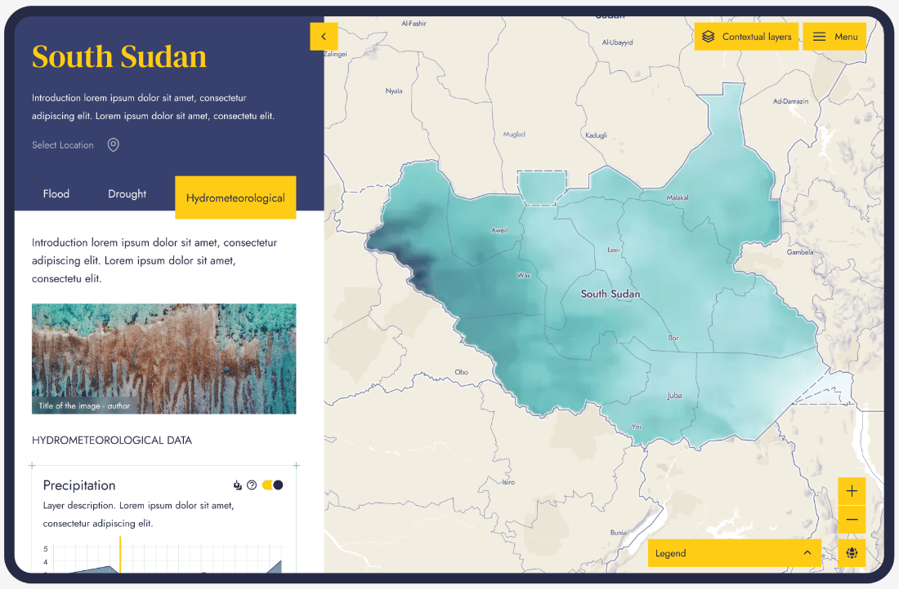

# South Sudan Pilot

The South Sudan Pilot aims to develop first-generation flood and drought hazard maps for the country and create a pilot tool to improve access to water management data. By consolidating dispersed hydrological information and addressing data gaps, the pilot seeks to inform water resource management and investment decisions.

The platform is divided into 2 Node.js applications:

- a Content Management System (CMS) located in the `/cms` folder
- a client application located in the `/client` folder

More detailed documentation and instructions on how to run the applications are available in each of the folders.

## Architecture

![The front-end application accesses a Mapbox account, AWS S3 bucket and the CMS. The CMS relies on a PostgreSQL database. Everything but the Mapbox account are hosted on AWS. The general public can access the front-end application while administrators can access the CMS. Mapbox stores and serves the basemap, vector and some raster layers. AWS S3 stores and serves the pre-computed static and animated raster tiles. PostgreSQL stores data such as the locations, dataset metadata and layer confifiguration. It does not store any geospatial data.](./readme-architecture-diagram.png)