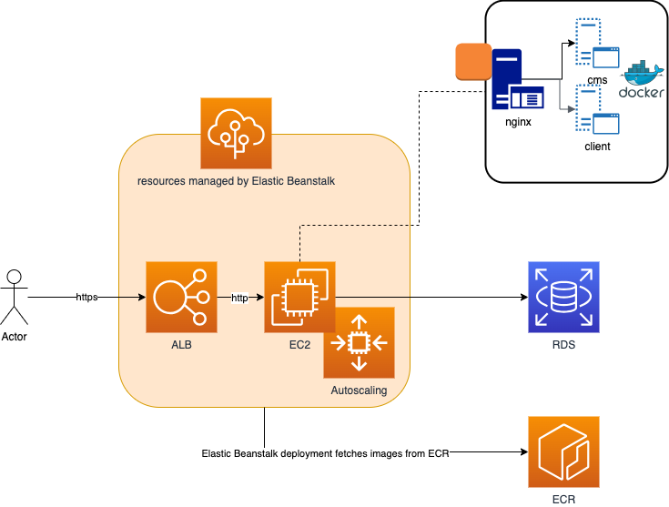

# Architecture

This solution is based on the following architecture:

The solution is composed of the following components:
- cms: a headless Strapi CMS that provides a REST API to manage the content of the website
- client: a Next.js application that consumes the CMS API and renders the website

Both are deployed on AWS using the following services:
- ECR: to store the Docker images
- Elastic Beanstalk: to deploy the Docker images using a multi-container Docker environment
- EC2: to host the Docker images (managed by Elastic Beanstalk)
- ALB: to route the traffic to the EC2 instances and provide SSL termination
- RDS: to host the database
- S3: to store raster and animated tiles (not included in the diagram)

Other AWS services are used internally by Elastic Beanstalk, for example:
- Autocaling: to scale the EC2 instances
- S3: to store the logs

# Deployment

The deployment is automated using a GH Action that builds the Docker images and deploys them to Elastic Beanstalk. It roughly follows these steps:
- Compile the required environment variables corresponding to the environment (e.g. staging, production) and component (e.g. client, cms) being deployed.
- Build the Docker images and publish them to ECR
- Generate the Elastic Beanstalk distribution bundle with the docker-compose file referencing these latest builds of the application, ebextensions, nginx configurations, etc. and deploy it to Elastic Beanstalk

# Infrastructure as Code

The resources required to deploy the solution are defined in the `infrastructure` folder. The infrastructure is defined using `Terraform`.

There are two Terraform projects in the `infrastructure` folder:
- `state`: to create an initial store the Terraform remote state in an S3 bucket, for all environments. This project must be deployed first and "used" only once.
- `base`: to deploy the infrastructure, using the remote state stored in the S3 bucket. This requires to have the remote state already created and configured on the `terraform/backend s3` block (which is already done in this project)

You will need to have an AWS user with the proper permissions to `apply` changes to the infrastructure (for example `AdministratorAccess` policy). In order to get authentication credentials for Terraform, follow the steps on https://registry.terraform.io/providers/hashicorp/aws/latest/docs#authentication-and-configuration . The same applies when Github Secrets/Variables are updated, you will need a GitHub user with the proper permissions. Follow these instructions to set up the GH credentials for the GH Terraform provider https://registry.terraform.io/providers/integrations/github/latest/docs#authentication

# Elastic Beanstalk customisation

Customisation of the Elastic Beanstalk environment is done partly at the point of provisioning. For example, the instance types of the EC2 and RDS instances.

However, it is also possible to customise the environment after it has been provisioned. For example, the environment variables of the EC2 instances, nginx configurations.

The customisation options for Amazon Linux 2 platform can be found here:
https://docs.aws.amazon.com/elasticbeanstalk/latest/dg/platforms-linux-extend.html

We're using the following customisation options, using the ".platform" folder:
- .platform/nginx/conf.d/platform.conf: to configure nginx to proxy the requests to the CMS and client applications
- .ebextensions/authorized_keys.config: to add public SSH keys to the EC2 instances
